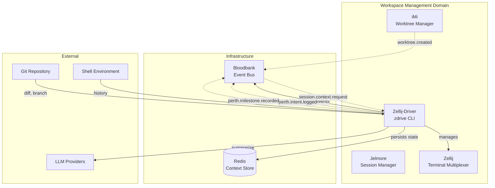

# Zellij-Driver (Perth) - GOD Document

> **Guaranteed Organizational Document** - Developer-facing reference for Zellij-Driver
>
> **Last Updated**: 2026-02-02
> **Domain**: Workspace Management
> **Status**: Development

---

## Product Overview

**Zellij-Driver** (CLI: `zdrive`, internal codename: **Perth**) is a cognitive context manager for Zellij terminal sessions. It bridges the gap between ephemeral terminal work and persistent knowledge by tracking developer intent, logging milestones, and maintaining session context across workspace sessions.

Unlike traditional terminal session managers that focus on layout persistence, Zellij-Driver captures the *why* behind terminal activity - what you were trying to accomplish, what you achieved, and where you left off. This context enables AI agents to resume work intelligently and helps developers maintain flow across interruptions.

**Key Capabilities:**
- **Intent Logging**: Record work progress with typed entries (checkpoints, milestones, explorations)
- **Context Persistence**: Redis-backed state survives Zellij restarts and session switches
- **LLM-Powered Snapshots**: Auto-generate summaries from shell history, git diffs, and file changes
- **Session Restoration**: Capture and restore complete Zellij session layouts with pane context
- **Agent Integration**: First-class support for AI agent contributions with source tracking
- **Bloodbank Events**: Emit events for 33GOD ecosystem integration and observability

---

## Architecture Position



**Role in Pipeline**: Zellij-Driver serves as the **cognitive context layer** for terminal sessions. It sits between the terminal multiplexer (Zellij) and the 33GOD event infrastructure (Bloodbank), enriching workspace state with semantic meaning. When agents claim worktrees via iMi, Zellij-Driver tracks their progress. When sessions complete, it publishes milestones for observability.

---

## Event Contracts

### Bloodbank Events Emitted

| Event Name | Routing Key | Payload Schema | Trigger Condition |
|------------|-------------|----------------|-------------------|
| `perth.pane.created` | `perth.pane.created` | `PaneCreatedPayload` | New pane created via `zdrive pane` |
| `perth.pane.opened` | `perth.pane.opened` | `PaneOpenedPayload` | Existing pane resumed/opened |
| `perth.tab.created` | `perth.tab.created` | `TabCreatedPayload` | New tab created via `zdrive tab create` |
| `perth.intent.logged` | `perth.intent.logged` | `IntentLoggedPayload` | Intent logged via `zdrive pane log` |
| `perth.milestone.recorded` | `perth.milestone.recorded` | `MilestoneRecordedPayload` | Entry with `--type milestone` logged |

**Event Envelope Structure:**

```json
{
  "event_type": "perth.intent.logged",
  "timestamp": "2026-02-02T12:00:00Z",
  "payload": {
    "pane_name": "fix-auth",
    "intent_id": "uuid-v4",
    "summary": "Completed OAuth integration",
    "entry_type": "milestone",
    "source": "manual",
    "artifacts": ["src/auth.rs"]
  },
  "metadata": {
    "source": "perth",
    "version": "0.1.0",
    "correlation_id": "pr-42",
    "session": "my-session"
  }
}
```

### Bloodbank Events Consumed

| Event Name | Routing Key | Handler | Purpose |
|------------|-------------|---------|---------|
| `session.context.request` | `session.context.#` | _Future implementation_ | Respond with current session context |
| `imi.worktree.created` | `imi.worktree.#` | _Future implementation_ | Auto-create tabs for new worktrees |

**Note:** Event consumption is planned for future releases. Current implementation focuses on event emission for observability.

---

## Non-Event Interfaces

### CLI Interface

```bash
# Binary name
zdrive

# Or alias (configurable via symlink)
znav
```

**Commands:**

| Command | Description | Example |
|---------|-------------|---------|
| `zdrive pane <name>` | Create or focus a named pane | `zdrive pane my-feature` |
| `zdrive pane log <name> "<summary>"` | Log intent entry | `zdrive pane log api "Fixed auth bug" --type milestone` |
| `zdrive pane history <name>` | View intent history | `zdrive pane history api --format json` |
| `zdrive pane snapshot <name>` | LLM-powered auto-summary | `zdrive pane snapshot my-feature` |
| `zdrive pane info <name>` | Get pane metadata | `zdrive pane info build` |
| `zdrive pane batch --tab <tab> --panes a,b,c` | Create multiple panes | `zdrive pane batch --tab fixes --panes auth,api,db` |
| `zdrive tab <name>` | Create or focus tab | `zdrive tab backend` |
| `zdrive tab create <name>` | Create tab with options | `zdrive tab create fixes --correlation-id pr-42` |
| `zdrive tab info <name>` | Get tab metadata | `zdrive tab info backend` |
| `zdrive list` | Show all tracked panes | `zdrive list` |
| `zdrive reconcile` | Sync state with Zellij | `zdrive reconcile` |
| `zdrive snapshot create <name>` | Capture session state | `zdrive snapshot create pre-refactor` |
| `zdrive snapshot restore <name>` | Restore session from snapshot | `zdrive snapshot restore pre-refactor` |
| `zdrive snapshot list` | List saved snapshots | `zdrive snapshot list --all-sessions` |
| `zdrive snapshot daemon` | Auto-snapshot at intervals | `zdrive snapshot daemon --interval 300` |
| `zdrive config show` | Display configuration | `zdrive config show` |
| `zdrive config set <key> <value>` | Set configuration value | `zdrive config set llm.provider anthropic` |
| `zdrive config consent --grant` | Grant LLM data consent | `zdrive config consent --grant` |
| `zdrive migrate` | Migrate from v1 keyspace | `zdrive migrate --dry-run` |

### Redis Data Model

**Key Patterns:**

| Key Pattern | Type | Purpose |
|-------------|------|---------|
| `znav:pane:<name>` | Hash | Pane metadata (legacy, will migrate) |
| `perth:pane:<name>:history` | List | Intent history entries (newest first) |
| `perth:tab:<session>:<name>` | Hash | Tab metadata with correlation ID |
| `perth:snapshots:<session>:<name>` | String (JSON) | Session snapshot data |

**Pane Hash Fields:**

```redis
HGETALL znav:pane:my-feature
# session: "my-session"
# tab: "backend"
# pane_id: "1"
# created_at: "2026-02-02T10:00:00Z"
# last_seen: "2026-02-02T12:00:00Z"
# last_accessed: "2026-02-02T12:00:00Z"
# stale: "false"
# last_intent: "Implementing OAuth flow"
# last_intent_at: "2026-02-02T11:30:00Z"
# meta:position: "2"
# meta:cwd: "/home/user/project"
```

**Intent Entry JSON:**

```json
{
  "id": "uuid-v4",
  "timestamp": "2026-02-02T11:30:00Z",
  "summary": "Implementing OAuth flow",
  "entry_type": "checkpoint",
  "artifacts": ["src/oauth.rs", "tests/oauth_test.rs"],
  "commands_run": 15,
  "goal_delta": "Added token validation",
  "source": "manual"
}
```

---

## Technical Deep-Dive

### Technology Stack

- **Language**: Rust (2021 edition)
- **Async Runtime**: Tokio (multi-threaded)
- **CLI Framework**: Clap v4 (derive API)
- **Redis Client**: `redis` crate with async support
- **HTTP Client**: Reqwest (for LLM APIs)
- **Message Queue**: Lapin (AMQP 0.9.1 for RabbitMQ)
- **JSON**: Serde + serde_json

**Key Dependencies:**

| Crate | Purpose |
|-------|---------|
| `anyhow` | Error handling |
| `chrono` | Timestamps with timezone support |
| `chrono-humanize` | Relative time formatting ("2 hours ago") |
| `colored` | Terminal color output |
| `lapin` | AMQP/RabbitMQ client |
| `redis` | Redis async client |
| `regex` | Secret filtering patterns |
| `semver` | Zellij version compatibility checking |
| `tokio` | Async runtime |
| `uuid` | Intent entry IDs |

### Architecture Pattern

Zellij-Driver follows a **layered orchestration pattern**:

```
┌─────────────────────────────────────────────────────┐
│                      CLI Layer                       │
│            (cli.rs - Command Parsing)                │
└─────────────────────────────────────────────────────┘
                          │
                          ▼
┌─────────────────────────────────────────────────────┐
│                 Orchestrator Layer                   │
│          (orchestrator.rs - Business Logic)          │
│    - Coordinates state, Zellij, events              │
│    - Handles LLM snapshots                          │
│    - Manages session restoration                    │
└─────────────────────────────────────────────────────┘
            │              │              │
            ▼              ▼              ▼
┌───────────────┐ ┌───────────────┐ ┌───────────────┐
│  StateManager │ │ ZellijDriver  │ │EventPublisher │
│  (state.rs)   │ │  (zellij.rs)  │ │(bloodbank.rs) │
│               │ │               │ │               │
│ Redis CRUD    │ │ CLI wrapper   │ │ AMQP publish  │
│ Intent history│ │ Tab/pane mgmt │ │ Event envelop │
│ Snapshots     │ │ Layout dump   │ │ Graceful fail │
└───────────────┘ └───────────────┘ └───────────────┘
```

### Key Implementation Details

#### Intent Tracking

Intent entries are stored in Redis lists with newest-first ordering:

1. `LPUSH` adds new entries at head of list
2. `LTRIM` enforces retention limit (default: 100 entries)
3. Last intent summary cached in pane hash for quick access

```rust
// Entry types determine significance
pub enum IntentType {
    Milestone,    // Major accomplishments
    Checkpoint,   // Regular progress markers (default)
    Exploration,  // Research/investigation
}

// Source tracks human vs agent contributions
pub enum IntentSource {
    Manual,       // Human-entered (default)
    Automated,    // System-generated (e.g., snapshot)
    Agent,        // AI agent contributions
}
```

#### LLM Snapshot Pipeline

The snapshot command collects context and calls an LLM:

```
Shell History → Secret Filter → Context Collector → LLM Provider → Intent Entry
     ↓               ↓                 ↓                 ↓
  ~/.zsh_history  Regex patterns   Aggregates:        Generates:
  ~/.bash_history API keys         - Shell cmds       - Summary
                  Passwords        - Git diff         - Suggested type
                  Tokens           - Recent files     - Key files
```

**Privacy Protections:**

1. **Explicit Consent**: Must run `zdrive config consent --grant` before LLM sends data
2. **Secret Filtering**: Regex patterns detect and redact API keys, passwords, tokens
3. **Local Option**: Ollama provider keeps all data local

**Circuit Breaker:**

The LLM client implements a circuit breaker pattern:

- Opens after 3 consecutive failures
- Half-opens after 5 minute cooldown
- Single success closes circuit

#### Bloodbank Integration

Events are published asynchronously with graceful degradation:

```rust
// Connection is lazy - established on first publish
// If RabbitMQ unavailable, logs warning and continues
pub async fn publish<T: Serialize>(&self, event_type: &str, payload: T) {
    if !self.config.enabled {
        return;  // Bloodbank disabled, skip silently
    }
    // ... publish logic with graceful fallback
}
```

**Exchange Configuration:**

- **Exchange**: `bloodbank.events` (topic type)
- **Routing Key**: Event type (e.g., `perth.pane.created`)
- **Persistence**: Messages marked persistent (delivery mode 2)

#### Session Snapshots

Snapshots capture complete session state for restoration:

```rust
pub struct SessionSnapshot {
    pub schema_version: String,  // "1.0"
    pub id: Uuid,
    pub name: String,
    pub session: String,
    pub created_at: DateTime<Utc>,
    pub description: Option<String>,
    pub parent_id: Option<Uuid>,  // For incremental snapshots
    pub tabs: Vec<TabSnapshot>,
    pub pane_count: usize,
}
```

**Incremental Snapshots:**

Snapshots can reference a parent, enabling:
- Ancestry chain traversal
- Delta comparison
- Storage optimization (planned)

**Retention Policy:**

- Default limit: 20 snapshots per session
- Enforced after each create
- Oldest snapshots pruned first

### Data Models

#### Core Types

```rust
// Intent entry - single log record
pub struct IntentEntry {
    pub id: Uuid,
    pub timestamp: DateTime<Utc>,
    pub summary: String,
    pub entry_type: IntentType,
    pub artifacts: Vec<String>,
    pub commands_run: Option<usize>,
    pub goal_delta: Option<String>,
    pub source: IntentSource,
}

// Pane record - pane metadata
pub struct PaneRecord {
    pub pane_name: String,
    pub session: String,
    pub tab: String,
    pub pane_id: Option<String>,
    pub created_at: String,
    pub last_seen: String,
    pub last_accessed: String,
    pub meta: HashMap<String, String>,
    pub stale: bool,
}

// Tab record - tab metadata with correlation
pub struct TabRecord {
    pub tab_name: String,
    pub session: String,
    pub correlation_id: Option<String>,
    pub created_at: String,
    pub last_accessed: String,
    pub meta: HashMap<String, String>,
}
```

#### LLM Context

```rust
// Collected context for LLM summarization
pub struct SessionContext {
    pub shell_history: Vec<String>,  // Filtered for secrets
    pub git_diff: Option<String>,    // Filtered for secrets
    pub cwd: String,
    pub active_files: Vec<String>,   // Recently modified
    pub git_branch: Option<String>,
    pub pane_name: String,
    pub existing_summary: Option<String>,  // For continuity
}
```

### Configuration

**Config File Location:**

```
$XDG_CONFIG_HOME/zellij-driver/config.toml
~/.config/zellij-driver/config.toml
```

**Configuration Options:**

```toml
# Redis connection
redis_url = "redis://127.0.0.1:6379/"

# LLM settings
[llm]
provider = "anthropic"  # anthropic, openai, ollama, none
model = "claude-sonnet-4-20250514"
max_tokens = 1024
# anthropic_api_key = "..."  # Or use ANTHROPIC_API_KEY env
# openai_api_key = "..."     # Or use OPENAI_API_KEY env
# ollama_url = "http://localhost:11434"

# Privacy consent
[privacy]
consent_given = false
consent_timestamp = "2026-02-02T12:00:00Z"

# Display options
[display]
show_last_intent = true  # Show context on pane resume

# Bloodbank event publishing
[bloodbank]
enabled = false  # Set true to publish events
amqp_url = "amqp://127.0.0.1:5672/%2f"
exchange = "bloodbank.events"
routing_key_prefix = "perth"

# Tab naming convention
[tab]
naming_pattern = "^[a-zA-Z0-9_-]+\\([a-zA-Z0-9_-]+\\)$"  # name(context)

# Snapshot retention
[snapshot]
retention_limit = 20
```

---

## Development

### Setup

```bash
# Clone repository
git clone https://github.com/delorenj/33GOD.git
cd 33GOD/zellij-driver

# Install Rust toolchain (if needed)
curl --proto '=https' --tlsv1.2 -sSf https://sh.rustup.rs | sh

# Build
cargo build --release

# Add to PATH
ln -s $(pwd)/target/release/zdrive ~/.local/bin/zdrive
```

### Prerequisites

- **Zellij** v0.39.0 or later
- **Redis** server running locally (or configure URL)
- **RabbitMQ** (optional, for Bloodbank events)
- **Rust** toolchain (1.70+)

### Running Locally

```bash
# Start Redis (if not running)
docker run -d -p 6379:6379 redis:7

# Start RabbitMQ (optional, for events)
docker run -d -p 5672:5672 -p 15672:15672 rabbitmq:3-management

# Run zdrive
cargo run -- pane my-feature
cargo run -- pane log my-feature "Testing intent logging"
cargo run -- pane history my-feature
```

### Testing

```bash
# Run all tests
cargo test

# Run with output
cargo test -- --nocapture

# Run specific test
cargo test test_intent_entry_serialization

# Format code
cargo fmt

# Lint
cargo clippy
```

### Environment Variables

| Variable | Purpose | Default |
|----------|---------|---------|
| `ZELLIJ_SESSION_NAME` | Current Zellij session (set by Zellij) | - |
| `ANTHROPIC_API_KEY` | Anthropic API key for Claude | - |
| `OPENAI_API_KEY` | OpenAI API key | - |
| `HISTFILE` | Shell history file path | `~/.zsh_history` |
| `NO_COLOR` | Disable colored output | - |

---

## Deployment

### Binary Distribution

The `zdrive` binary is statically compiled and can be distributed directly:

```bash
# Build release binary
cargo build --release

# Binary at
./target/release/zdrive
```

### Docker (Optional)

A Dockerfile is available for containerized deployment:

```bash
# Build image
docker build -t zdrive .

# Run with Redis
docker run --network host zdrive pane my-feature
```

### Configuration Priority

1. Command-line arguments
2. Environment variables
3. Config file (`~/.config/zellij-driver/config.toml`)
4. Built-in defaults

---

## References

- **Domain Doc**: `docs/domains/workspace-management/GOD.md`
- **System Doc**: `docs/GOD.md`
- **Source**: `zellij-driver/`
- **README**: `zellij-driver/README.md`
- **PRD**: `zellij-driver/docs/prd-perth-2026-01-04.md`
- **Architecture**: `zellij-driver/docs/architecture-perth-2026-01-05.md`

---

## Appendices

### Appendix A: Output Formats

The `--format` flag supports multiple output modes:

| Format | Use Case | Example |
|--------|----------|---------|
| `text` | Human reading, terminal | Colors, relative times |
| `json` | API integration, tools | Pretty-printed JSON |
| `json-compact` | Scripting, piping | Single-line JSON |
| `markdown` | Obsidian, documentation | YAML frontmatter + Markdown |
| `context` | Agent prompt injection | ~1000 token narrative |

### Appendix B: Entry Type Icons

| Type | Icon | Badge |
|------|------|-------|
| Milestone | ★ | `[★ MILESTONE]` (yellow) |
| Checkpoint | ● | `[● CHECKPOINT]` (green) |
| Exploration | ◈ | `[◈ EXPLORATION]` (cyan) |

### Appendix C: Source Indicators

| Source | Badge | Use Case |
|--------|-------|----------|
| Manual | (none) | Human-entered entries |
| Automated | ⚡ AUTO | System-generated snapshots |
| Agent | 🤖 AGENT | AI agent contributions |

### Appendix D: Migration from v1.0

The `migrate` command upgrades keyspace from `znav:*` to `perth:*`:

```bash
# Preview migration
zdrive migrate --dry-run

# Execute migration
zdrive migrate
```

**Migrated Keys:**
- `znav:pane:<name>` → `perth:pane:<name>` (pane metadata)
- Intent history uses new `perth:pane:<name>:history` format

### Appendix E: Shell Hook Examples

**Zsh Auto-Snapshot:**

```zsh
zdrive_snapshot_on_complete() {
    local last_status=$?
    local elapsed=$SECONDS
    if [[ $elapsed -gt 30 ]]; then
        local pane_name=$(basename "$PWD")
        zdrive pane snapshot "$pane_name" 2>/dev/null &!
    fi
    return $last_status
}
preexec() { SECONDS=0 }
precmd() { zdrive_snapshot_on_complete }
```

**Git Post-Commit Hook:**

```bash
#!/bin/bash
PANE_NAME=$(basename "$PWD")
COMMIT_MSG=$(git log -1 --format=%s)
FILES=$(git diff-tree --no-commit-id --name-only -r HEAD | head -5)
zdrive pane log "$PANE_NAME" "Committed: $COMMIT_MSG" \
    --type milestone --artifacts $FILES
```
